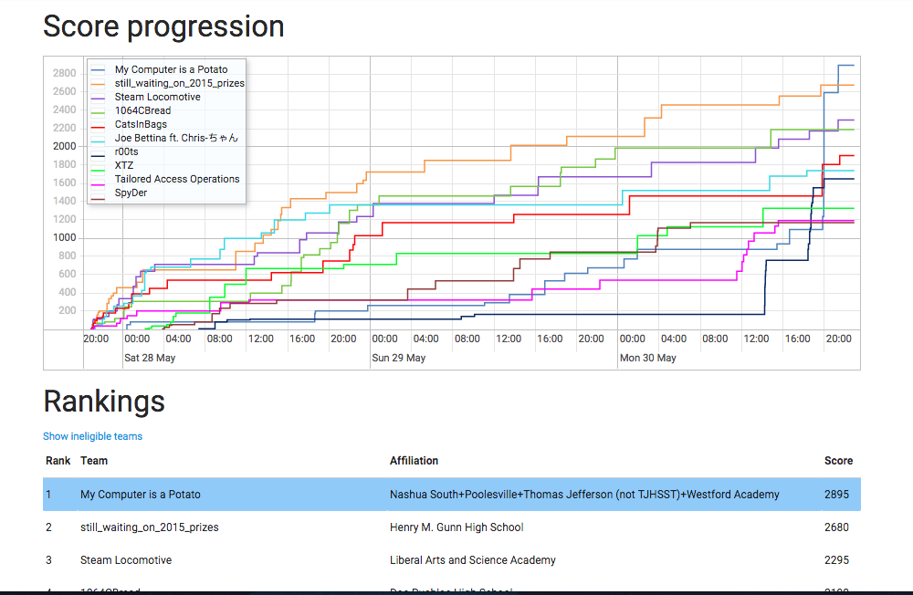

# TJCTF 2016 Writeups - My Computer is a Potato
This repository contains some writeups for the problems in TJCTF 2016. Our team name was "My Computer is a Potato", and we placed 1st.

## Scoreboard

In case you doubt us.

## Members
* Bret Barkley (brett0_ghett0) - Thomas Jefferson (PA)
* Kevin Shen (neptunia/MegaAbsol) - Poolesville HS
* Harshal Sheth (hsheth2) - Westford Academy
* Ankur Sundara (arxenix/bobacadodl) - Nashua HS South
* Aashish Welling (omegablitz) - Nashua HS South