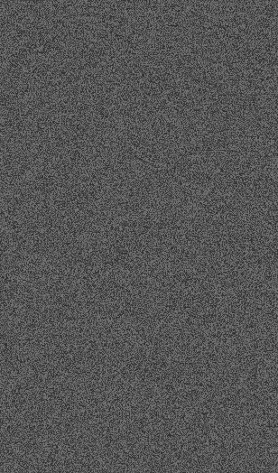
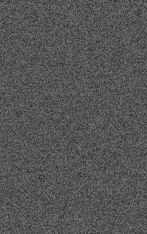
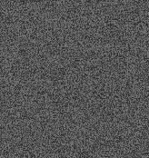
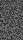

# Basic Images (65 pts)

---

## Problem
stuff

---

## Solution

We take the RGB value (any work) of the gray pixels, and convert to ascii. This re convert from base64 to hex -> stick into new png image. repeat. I wrote a PIL program to do this, which took in the picture, and outputted into another file the base64 data.
The images we get: 
original: 

 
Iteration 1: 

 
Iteration 2: 

 
Iteration 3: 

 
Iteration 4: 

 
Iteration 5: 

 
Iteration 7: 

 
Finally we convert this data from base64 to ascii for the flag.

---

## Flag
`tjctf{asc11_c0l0r_inc3pt1on}`