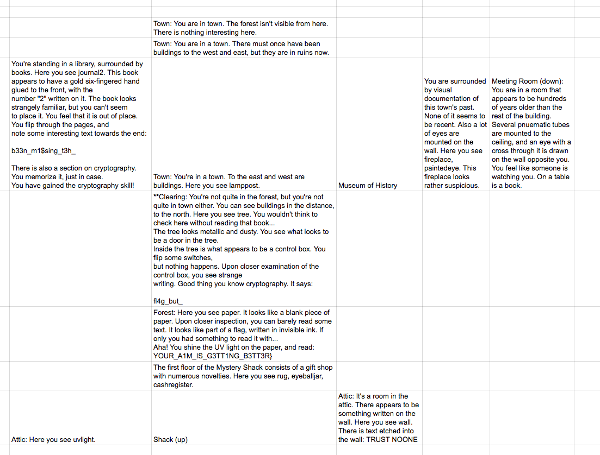

# gravitymud (90 pts)

---
## Problem
Wanna hear a joke? north, south, east, west, up, down, examine item

`nc p.tjctf.org 8006`

## Solution
I used the following python script to explore this map:
```
import socket
from pprint import pprint

#create an INET, STREAMing socket
s = socket.socket(
    socket.AF_INET, socket.SOCK_STREAM)
#now connect to the web server on port 80
# - the normal http port
s.connect(("p.tjctf.org", 8006))

cmds = """south
south
up
west
examine uvlight
east
down
examine rug
north
examine paper
north
north
west
examine journal2
east
east
east
examine paintedeye
down
examine book
up
west
west
south
examine tree
south
south
up
east
examine wall
west
down
north
examine paper
"""

cmds = cmds.strip().split('\n')
for cmd in cmds:
    out = s.recv(1000)
    print out
    print "SENDING:", cmd
    s.send(cmd +'\n')
    

fin = s.recv(1000)
print fin
```
I found the above directions through experimentation. Based on this, I created the following map:


From this map, we see that the flag is split into four parts.
- `tjctf{y0u_m1ght_h@v3_`
- `b33n_m1$sing_t3h_`
- `fl4g_but_`
- `YOUR_A1M_IS_G3TT1NG_B3TT3R}`

Combining these, we get the actual flag.

## Flag
Flag: `tjctf{y0u_m1ght_h@v3_b33n_m1$sing_t3h_fl4g_but_YOUR_A1M_IS_G3TT1NG_B3TT3R}`