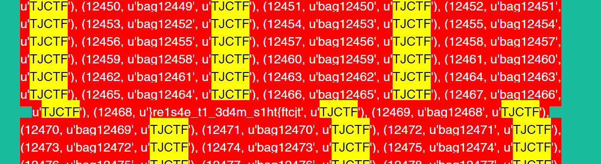

# Super Questionable Luggage Service (30 pts)

---

## Problem

---

## Solution
It seems that the "retrieve luggage" function is vulnerable. Plugging in `' OR ''='`, we are able to dump the whole database. Scrolling down, we see something interesting:

We reverse this string for the flag.

---

## Flag
`tjctf{th1s_m4d3_1t_e4s1er}`